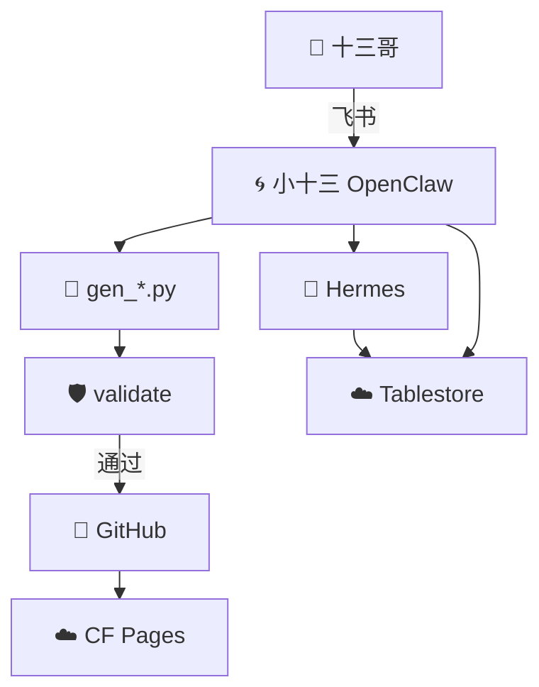
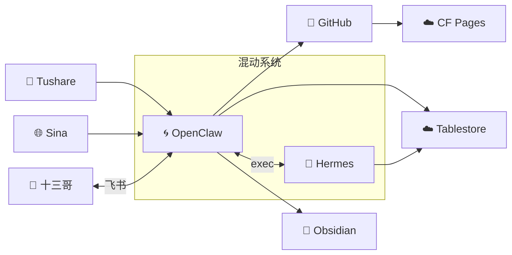
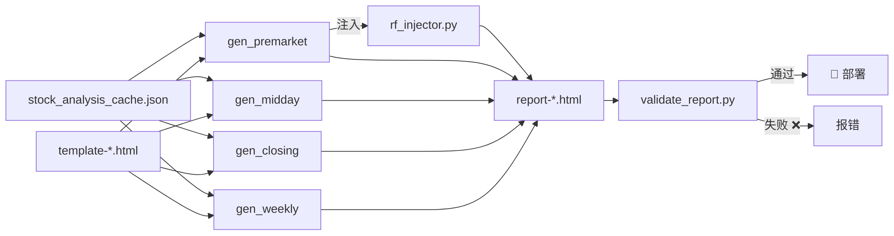
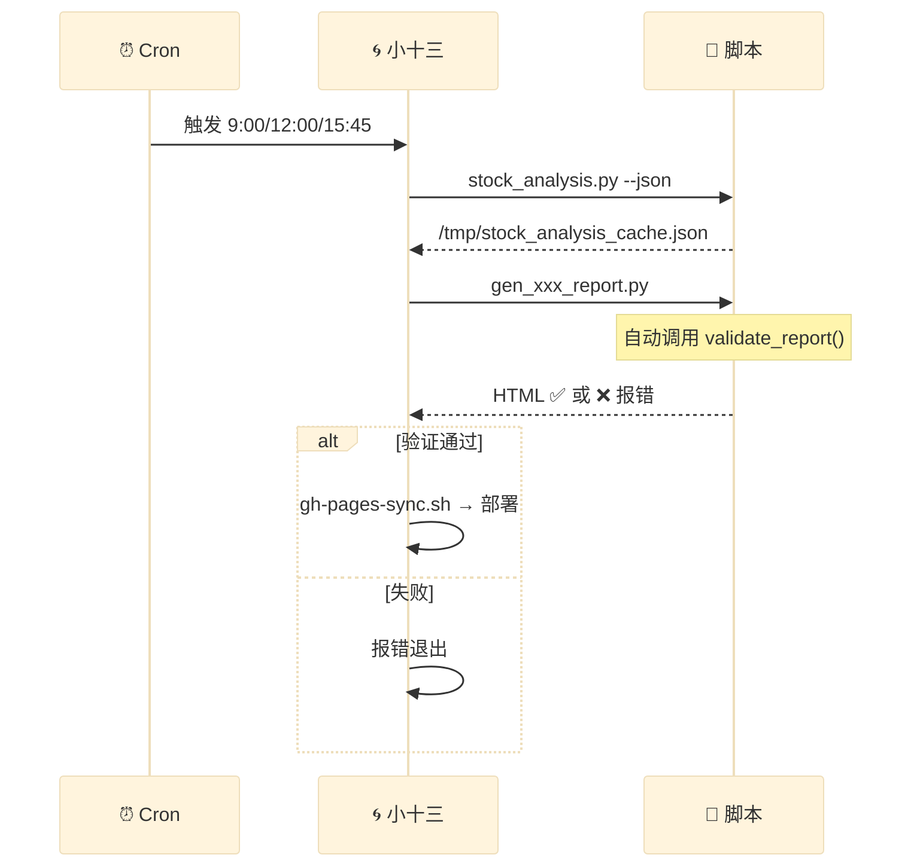
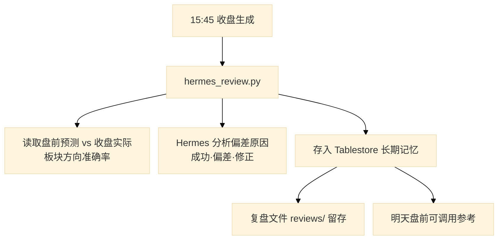
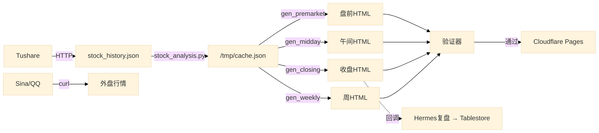
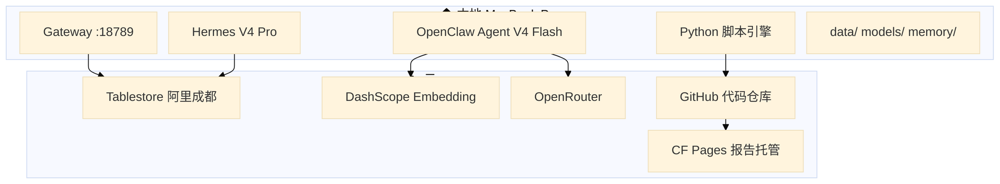

# 🌀 OpenClaw + Hermes 混动系统架构说明书

| 文档编号 | ARCH-2026-001 | 版本 | v2.0 | 更新 | 2026-06-04 |
|:---------|:-------------|:----|:-----|:-----|:----------|
| 状态 | ✅ 已发布 | 密级 | 内部 | 维护 | 小十三 |

---

## 📑 目录

1. [架构全景](#1) · [角色职责](#2) · [C4 模型](#3) · [技术选型](#4)
2. [报告管线](#5) · [量化引擎](#6) · [验证体系](#7) · [ML 模型](#8)
3. [记忆系统](#9) · [数据流](#10) · [部署](#11) · [安全约束](#12) · [运维](#13)

---

## 1. 架构全景

### 1.1 原则

| 原则 | 说明 |
|:-----|:------|
| 🧩 职责分离 | OpenClaw=交互+调度；Hermes=分析+记忆；脚本=生成+验证 |
| 🚫 AI 不写生产代码 | 报告必须通过 gen_*.py 脚本生成 |
| 🛡️ 防御编程 | 每次生成自动验证，失败阻断输出 |
| 📐 模板驱动 | 样式由 candidate 约束，内容由数据源填充 |

### 1.2 系统架构



### 1.3 分工清晰图

| 领域 | 🌀 OpenClaw（小十三） | 🤖 Hermes |
|:-----|:---------------------|:-----------|
| 🎯 定位 | 管家，交互+调度 | 分析师，幕后干活 |
| 💬 通道 | 飞书私聊 ← 十三哥 | CLI（小十三调用） |
| 📝 记忆 | 短期对话 + MEMORY.md | **长期记忆（Tablestore）** |
| ⏰ 调度 | **cron 9:00/12:00/15:45** | 复盘循环（收盘后） |
| 📄 报告 | **gen_*.py 生成+验证+部署** | **深度分析（V4 Pro）** |
| 🔄 学习 | 执行脚本 | **每日复盘循环** |
| 💾 存储 | 读写 Tablestore | 读写 **同一份 Tablestore** |

---

## 2. C4 模型

### 2.1 系统上下文



### 2.2 报告管线组件



---

## 3. 技术选型

### 3.1 技术栈

| 层级 | 技术 | 版本 | 用途 |
|:-----|:-----|:------|:------|
| Agent 框架 | OpenClaw / Hermes | 2026.6.1 / v0.15.1 | 智能体宿主 |
| 语言 | Python 3.11.15 / Node.js 26 | — | 脚本 / 网关 |
| ML | scikit-learn | 最新 | 随机森林 |
| 行情 | tushare / qt.gtimg.cn / Sina | — | A股 / 外盘数据 |
| 记忆 | Mem0 + Tablestore（阿里云成都） | — | 向量存储 |
| 通道 | 飞书 | — | 用户交互 |
| 托管 | Cloudflare Pages + GitHub | — | 报告部署 |

### 3.2 模型选型

| 用途 | 模型 | 通道 | 月费 |
|:-----|:------|:------|:----:|
| 🟦 日常对话 | DeepSeek V4 Flash | OpenRouter | ¥5 |
| 🟧 深度分析 | DeepSeek V4 Pro | OpenRouter | ¥15 |
| 🟪 图片分析 | Qwen-Plus | DashScope | ¥2 |
| 📊 Embedding | text-embedding-v3 | DashScope | ¥1 |
| | | **合计** | **≈ ¥23** |

### 3.3 报告模板规范

| 报告 | 模板 | 主题色 | h2 | 表数 | 列数 |
|:-----|:-----|:-------|:--:|:----:|:----:|
| 📋 盘前 | `template-premarket.html` | 🔵 `#58a6ff` | 6 | 10 | 8 |
| 🌤️ 午间 | `template-midday.html` | 🟢 `#56d4dd` | 4 | 9 | 9 |
| 📊 收盘 | `template-closing.html` | 🔴 `#f85149` | 10 | 6 | metric-grid |
| 📈 周复盘 | `template-weekly.html` | 🩷 `#f778ba` | 7 | 11 | summary-card |

---

## 4. 报告管线

### 4.1 全流程



### 4.2 时间线

| 时间 | 任务 | 脚本 | 交付物 |
|:----:|:-----|:-----|:-------|
| 🕐 01:00 | 系统自检 | `daily_check.py` | 运维报告 |
| 🕐 07:00 | TED 推送 | cron | 飞书 |
| 🕘 09:00 | **盘前生成** | `gen_premarket_report.py` | HTML → CF Pages |
| 🕘 09:15 | 盘前推送 | `premarket-push` | 飞书 |
| 🕛 12:00 | **午间生成** | `gen_midday_report.py` | HTML → CF Pages |
| 🕐 15:45 | **收盘生成 + Hermes复盘** | `gen_closing_report.py` + `hermes_review.py` | HTML → CF Pages |
| 🕓 16:00 | 收盘推送 | `closing-push` | 飞书 |
| 🕕 18:00 | 选股评分 | `daily_score_gen.py` | 数据 |
| 🕛 周日 | **周复盘** | `gen_weekly_report.py` | HTML → CF Pages |

### 4.3 统一模型权重

```
综合评分 = RS(23%) + 动量(18%) + MRD(9%) + 多因子(27%) + 轮动(13%) + 历史相似度(10%)
```

**v2.1 新增「历史相似度」维度（2026-06-06）：**
- 通过 RAG 检索 FAISS 中历史相似交易日
- 按各板块在相似日的涨跌情况加权计算得分 (0~100)
- 同时已作为随机森林第11维特征

---

## 5. 量化引擎

### 5.1 模块

| 模块 | 函数 | 输出 |
|:-----|:------|:------|
| RS 排名 | `calc_rs()` | rs_value · rs_score · rank (A+~D) |
| 多因子 | `calc_multi_factor()` | total_score · 子因子分解 |
| 波动预警 | `calc_volatility()` | 偏离度 · 等级 · 建议 |
| 技术面 | `calc_tech_signals()` | MA/布林/KDJ/MACD/RSI |
| 板块动量 | `calc_sector_momentum()` | top/bottom sectors · spread |
| 个股动量 | `calc_momentum()` | trend_slope · support/resistance |

### 5.2 数据依赖

```
tushare → stock_history.json (77只×64天)
                ↓
         stock_analysis.py
           │       │       │
           ↓       ↓       ↓
     rs_ranking  multi_factor  tech_signals
           │       │            │
           └───────┴────────────┘
                    ↓
            gen_xxx_report.py → HTML
```

---

## 6. 数据使用规范

### 6.1 核心原则

> **候选模板是「图纸」，不是「材料」。图纸告诉你墙多高、门多宽，但不告诉你该用哪批砖。**

### 6.2 数据红线

| # | 原则 | 说明 | 违规示例 |
|:-:|:-----|:------|:---------|
| 1 | **数据必须有来源** | 每条数据要能追到 cache/API/文件 | `price = '176.27'`（硬编码）|
| 2 | **gen脚本禁止硬编码** | 股票名、价格、百分比必须从数据源读取 | `price_map = {...}` |
| 3 | **候选只定义样式** | candidate 只贡献 CSS/布局/颜色值 | 从候选模板里抄样本数据行 |
| 4 | **全量数据不留白** | 占位符 `数据正在采集` 不允许出现在正式输出 | 今日要闻写"暂未接入" |
| 5 | **CSS类名不是颜色值** | 不能用 `up`/`down` 当颜色写进 `style=` | `<td style="color:up">` |

### 6.3 保障机制

| 层 | 工具 | 作用 |
|:---|:-----|:------|
| 🛡️ 编译时 | `audit_gen_scripts.py` | 扫描 gen 脚本中的候选模板股票名/价格 |
| 🛡️ 运行时 | `validate_report.py`（16项） | 验证输出与候选模板的结构一致性 |
| 🧠 人工 | 十三哥 Review | 肉眼发现 `color:up` 等验证器也漏掉的问题 |

---

## 7. 验证体系

| # | 检查项 | 方法 | 严重 |
|:-:|:-------|:-----|:----:|
| 1 | CSS 类完整性 | 候选 vs 生成 diff | 🔴 |
| 2 | 主题色 | 字符串查找 | 🔴 |
| 3 | h1 颜色/下划线 | CSS 解析 | 🟡 |
| 4 | 字体 | CSS 解析 | 🟢 |
| 5 | 板块结构 | h2 标签解析 | 🔴 |
| 6 | **逐section表格数** | 每个板块内 table 计数 | 🔴 |
| 7 | 表格列头 | th 标签解析 | 🔴 |
| 8 | colgroup 列宽 | class 解析 | 🟡 |
| 9 | 关键颜色值 | 颜色值查找 | 🟡 |
| 10 | 残留占位符 | 正则 `\{\{...\}\}` | 🔴 |
| 11 | 评级/信号标签 | class 查找 | 🟡 |
| 12 | Banner/Footer | div 查找 | 🟢 |
| 13 | 布局类 | CSS 查找 | 🟢 |
| 14 | 背景渐变 | CSS 查找 | 🟢 |
| 15 | **代码审计** | 扫描 gen 脚本 | 🟡 |
| 16 | **颜色值非类名** | 检查 `color:up/down` | 🟡 |

---

## 7. ML 模型

| 属性 | 值 |
|:------|:-----|
| 算法 | RandomForest (n_estimators=200, max_depth=8) |
| 特征 | 11 维（RS·多因子·板块·技术面·价格位置） |
| 样本 | 246 条（多时间切片） |
| 方向准确率 | **82%** |
| R² | 0.415 |
| 最强特征 | 价格位置(39.7%) · 当日涨跌(21.8%) · RS评分(10.5%) |

### 特征权重

```
f11 价格位置   ████████████████████ 39.7%
 f7 当日涨跌   ███████████          21.8%
 f2 RS评分     █████                10.5%
f10 布林位置   ████                  8.0%
 f3 多因子     ████                  7.3%
 f9 趋势标签   ███                   6.8%
 f1 RS归一     █                     2.9%
 f6 板块均分                           1.6%
 f5 板块动量                           0.8%
 f8 RS等级                             0.5%
 f4 RS原始                             0.0%
```

---

## 8. Hermes 复盘循环



---

## 9. 记忆系统

### 9.1 分层

| 层 | 存储 | 内容 | 访问 |
|:--:|:------|:------|:-----|
| L1 工作记忆 | 会话上下文 | 当前对话 | OpenClaw |
| L2 短期 | Mem0 + Tablestore | 对话历史+画像 | OpenClaw |
| L3 长期 | MEMORY.md | 手工精华 | OpenClaw |
| L4 跨系统 | Hermes Tablestore | 复盘经验 | Hermes+OC |

### 9.2 Tablestore

| 属性 | 值 |
|:------|:-----|
| 实例 | `openclaw-case`（阿里云成都） |
| 表 | `memories` |
| Embedding | text-embedding-v3 (DashScope) |
| 共享 | **OpenClaw + Hermes 同一份** |

---

## 10. 数据流



### 数据字典

| 数据 | 位置 | 频率 |
|:------|:------|:----:|
| `stock_history.json` | `data/` | 每日 15:45 |
| `premarket-predictions.json` | `/tmp/` | 每日 09:00 |
| `stock_analysis_cache.json` | `/tmp/` | 每次生成 |
| `report-*.html` | `daily-report-html/` | 每次生成 |
| `closing-review-*.txt` | `reviews/` | 每日 15:45 |

---

## 11. 部署

### 11.1 部署图



### 11.2 环境

| 组件 | 版本 | 端口 | 绑定 |
|:------|:------|:----:|:----:|
| macOS | 15.7.7 | — | — |
| Node.js | 26 | — | — |
| Python | 3.11.15 | — | — |
| OpenClaw Gateway | 2026.6.1 | 18789 | loopback |
| Hermes | v0.15.1 | — | — |
| scikit-learn | 最新 | — | — |

### 11.3 故障等级

| 等级 | 定义 | 处理 |
|:----:|:------|:------|
| 🔴 P0 | 报告无法生成/部署 | <15min 手动排查 |
| 🟠 P1 | 样式错乱/数据错误 | <1h 修复 gen 脚本 |
| 🟡 P2 | 验证器假阳性 | <1d 调整规则 |
| 🟢 P3 | 技术债务 | Sprint 内排期 |

---

## 12. 安全约束

### 🚫 红线

- ❌ 不直接改 `index.html`
- ❌ cron 不得由 AI 自由生成 HTML（必须执行 gen_*.py）
- ❌ 周末不发盘前/午间/收盘
- ❌ gen 脚本不得硬编码候选模板样本数据

### 🎨 颜色规范

```
📋 盘前简报  → 🔵 #58a6ff     🌤️ 午间监测 → 🟢 #56d4dd
📊 收盘简报  → 🔴 #f85149     📈 周复盘   → 🩷 #f778ba

🔴 #f85149 = 涨/利好   🟢 #3fb950 = 跌/利空
🟡 #d9a52e = 中性/注意  ⚪ #8b949e = 次要信息
```

### 📐 模板优先级

| 优先级 | 内容 | 示例 |
|:------:|:-----|:------|
| 🥇 | 流程模板 | `taskflows/*.md` |
| 🥈 | 样式模板 | `template-*.html` |
| 🥉 | 数据模板 | `template-stocks.json` |

---

## 13. 运维

### 每日自检（1:00）

```bash
openclaw status                    # 网关运行？
openclaw cron list                 # 任务全 ok？
hermes status                      # 在线？
cat data/stock_history.json | ...  # 数据最新？
curl -s -o /dev/null -w "%{http_code}" https://daily-report-3ai.pages.dev  # → 200
```

### 常用操作

```bash
python3 scripts/gen_premarket_report.py   # 手动盘前
python3 scripts/gen_midday_report.py      # 手动午间
python3 scripts/gen_closing_report.py     # 手动收盘
python3 scripts/audit_gen_scripts.py      # 代码审计
bash scripts/gh-pages-sync.sh              # 手动部署
```

### 排障速查

| 症状 | 排查 |
|:------|:------|
| 🔇 飞书无响应 | `openclaw gateway status` → `openclaw gateway restart` |
| ❌ 报告未推送 | `openclaw cron list` 看 lastRunStatus |
| 💥 Hermes 挂 | `hermes status` → 检查 config.yaml |
| 🐍 脚本报错 | 手动跑脚本看 traceback |
| ❌ 验证失败 | 读报错项，检查 candidate 模板 |
| 🌐 外盘无数据 | `curl -s 'https://hq.sinajs.cn/list=gb_dji'` |
| 📡 行情暂停 | 午间休市 11:30-13:00 期间返回昨日收盘 |
| 🔒 Git 推送 | 检查 `git remote -v` 的 token |

---

## 14. 演进路线

### 已完成（v2.0）

| 阶段 | 日期 |
|:------|:----:|
| 报告管线重构 gen_* + validate | 06-04 |
| 统一模型 v1（RS+动量+MRD+多因子+轮动） | 06-04 |
| 随机森林（方向准确率 82%） | 06-04 |
| 午间报告（实时行情+全持仓） | 06-04 |
| 验证器体系（15 项 + 代码审计） | 06-04 |
| Hermes 记忆激活+每日复盘 | 06-04 |
| cron 任务加固 | 06-04 |
| Obsidian 仓库统一 | 06-04 |

### 待定

| 优先级 | 内容 |
|:------:|:------|
| 🔴 | Hermes 记忆优化盘前预测 |
| 🔴 | 多智能体分工（研究员/分析师/撰写员） |
| 🟡 | 协整配对分析 |
| 🟡 | Ridge 回归多因子 |
| 🟢 | ACP 实时价格通道 |

---

## 15. 更新日志

| 日期 | 版本 | 变更 |
|:-----|:----:|:------|
| 2026-06-03 | v1.0 | 初版 |
| 2026-06-04 | v2.0 | 全线重构：报告管线·验证体系·ML·Hermes记忆·cron加固·仓库统一 |

---

> 🌀 每日 1:00 自动自检 · 维护人：小十三

| 2026-06-05 | v2.0 | 故障后自检补跑：全部通过

| 2026-06-05 | v2.0 | 补跑自检（11:42）：全部通过 ✅ 新增模型费用模块

| 2026-06-05 | v2.0 | 系统晨检补跑（12:04）：全部正常 🟢
| 2026-06-05 | v2.0 | 每日自检（12:25 cron触发）：全部通过 ✅ 更新演进路线图
